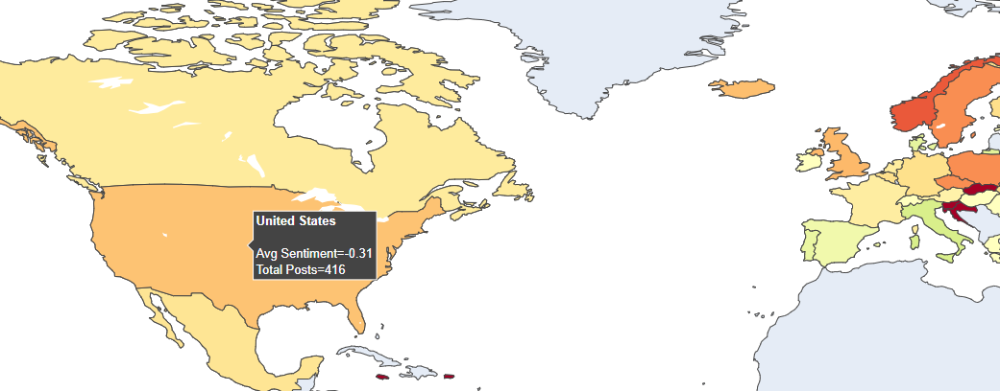
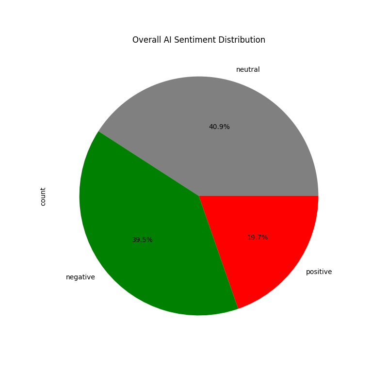
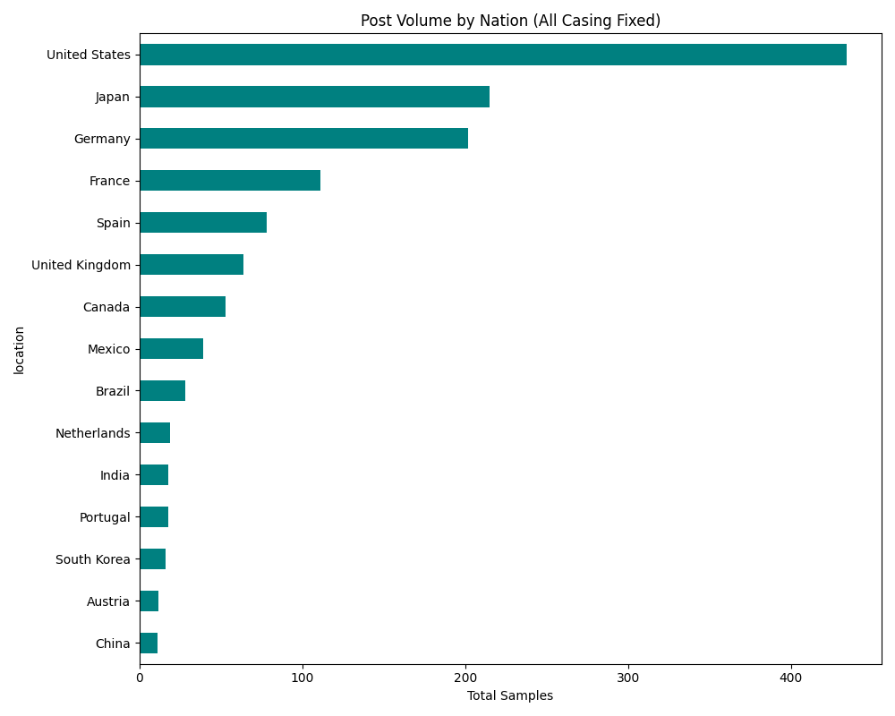

# Spatial Sentiment Analysis Project

A comprehensive toolset for collecting, processing, and analyzing AI-related posts from Bluesky Social with multilingual sentiment analysis and geolocation visualization.

# Overview

This project provides a complete pipeline for:
- **Collecting** AI-related posts from Bluesky using multiple search strategies
- **Processing** multilingual text with proper encoding fixes (Korean, Japanese, European languages)
- **Analyzing** sentiment using sentiment analysis models
- **Visualizing** results with interactive maps, charts, and word clouds
- **Merging** multiple datasets for comprehensive analysis


## Visualizations Preview


### Geographic Distribution

<p><em>Figure 1: Geographic distribution of AI sentiment across different countries</em></p>

An interactive world map showing sentiment distribution by country:

- **Color intensity**: Represents the volume of posts per country
- **Color scale**: Shows sentiment distribution (positive/negative/neutral ratios)
- **Interactive features**: Hover over countries to see detailed statistics
- **Global coverage**: Tracks AI discussions across multiple continents

<br>

---

### Sentiment Distribution

<p><em>Figure 2: Overall sentiment distribution showing neutral (40.9%), negative (39.5%), and positive (19.7%) posts</em></p>

<br>

---

### Post Volume by Country

<p><em>Figure 3: Top countries by volume of AI-related posts</em></p>


## Features

- **Multi-scraper variants** - Three different customizable collection strategies with increasing sophistication. 
- **User diversity controls** - Limits posts per user to prevent spam dominance and represent more users
- **Multilingual support** - Handles 100+ languages
- **Mojibake fixer** - Automatic detection and correction of text encoding issues
- **LIMITED Geolocation extraction** - Attempts to identify user locations from profiles and handles
- **Visualizations** - Choropleth maps, sentiment distributions, word clouds
- **Sentiment analysis** - Powered by `cardiffnlp/twitter-xlm-roberta-base-sentiment`


## Installation

```bash
# Clone the repository
git clone <your-repo-url>
cd <repository-name>

# Install dependencies
pip install -r requirements.txt
```


### Dependencies
- `streamlit` - Web dashboard (optional)
- `tweepy` - Twitter API (legacy)
- `atproto` - Bluesky API client
- `transformers` + `torch` - AI sentiment models
- `pandas` - Data manipulation
- `plotly` + `matplotlib` + `seaborn` - Visualizations
- `wordcloud` - Text visualization
- `ftfy` - Text encoding fixes
- `python-dotenv` - Environment management

  ## Usage

### 1. Collect Bluesky Posts

Choose from three scrapers with increasing sophistication:

#### Basic Scraper (`bluesky_scraper_1.py`)
Simple collection with basic location extraction.

```bash
python bluesky_scraper_1.py
```
*Edit the script to add your Bluesky credentials*

#### Diverse Scraper (`bluesky_scraper_2.py`)
Prevents multiple posts from same user, better extraction of European posts.

```bash
python bluesky_scraper_2.py
```

#### Clean Scraper (`bluesky_scraper_3.py` - **Recommended**)
Uses unambiguous AI terms only.

```bash
python bluesky_scraper_3.py
```

### 2. Merge Multiple CSV Files

Combine multiple collected files into one dataset:

```bash
python bluesky_merger.py
```

### 3. Fix Text Encoding Issues

Fix mojibake (garbled text) in Korean, Japanese, and other languages:

```bash
python bluesky_unicode_fix.py
```

### 4. Run Sentiment Analysis

Analyze sentiment using XLM-RoBERTa:

```bash
python bluesky_sentiment_analyzer.py
```

### 5. Generate Visualizations

Create maps, charts, and word clouds:

```bash
python bluesky_plotter.py
```

Outputs will be saved to the `plots/` directory.

## Output Files

- `bluesky_ai_*.csv` - Raw collected posts
- `bluesky_merged_cleaned.csv` - Merged dataset
- `bluesky_final_sentiment_results.csv` - Complete dataset with sentiment
- `bluesky_sentiment_countries_only.csv` - Filtered for samples with location data
